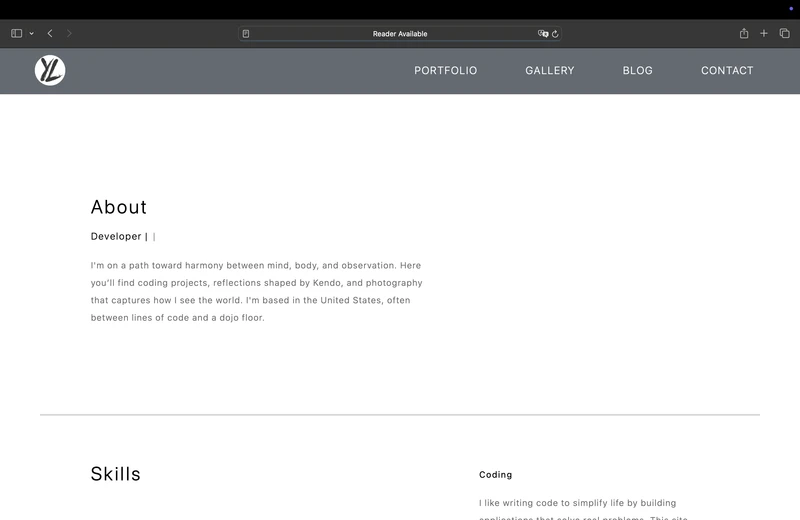
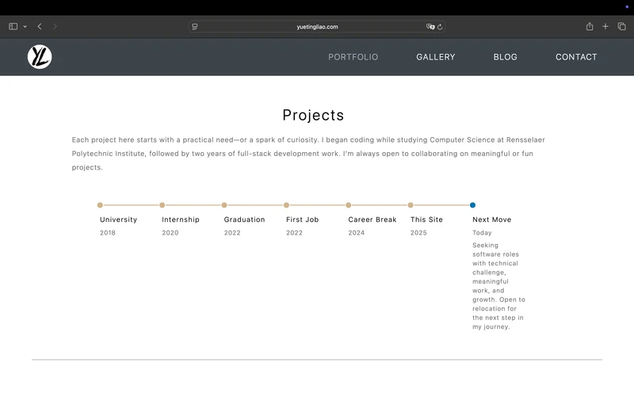
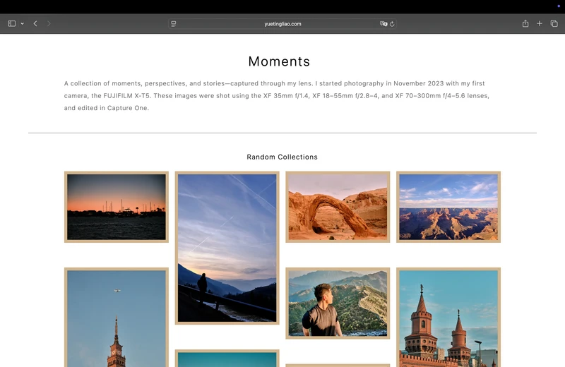
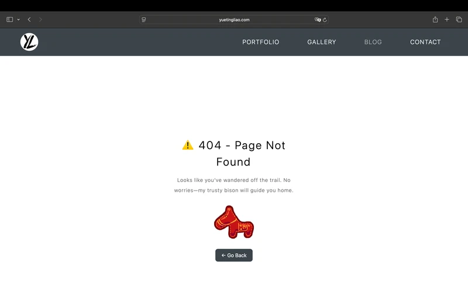

# Portfolio Website

A modern, responsive, and animated portfolio built with **React**, **TypeScript**, and **Vite**, deployed via **Vercel**. Designed to showcase personal coding projects, photography collections, and thoughts posts clearly, intuitively, and efficiently.

## 🌟 Overview

- [**Landing Page**](#🏠-landing-page) – Minimalistic and engaging intro.
- [**Coding Projects**](#💻-portfolio-page) – Dynamic showcases built from structured data.
- [**Photography Collections**](#📸-gallery-page) – Optimized, precomputed gallery layouts.
- [**Thoughts Posts**](#✍️-thoughts-page) – Markdown-based with enhanced readability and navigation.

---

## 🔗 Website Management

- Live Website [yuetingliao.com](https://yuetingliao.com)

- DNS Management: [Squarespace Domains](https://account.squarespace.com/domains)
- DNS Check: [Global DNS Checker](https://www.whatsmydns.net/#CNAME)

---

## 📸 Screenshots

<p align="center">
  
  
  
  
  
  

## </p>

## 🚀 Tech Stack

- **Framework**: React, TypeScript, Vite
- **Styling**: Tailwind CSS, CSS Modules
- **Icons**: Material Icons, Custom SVG Icons
- **Markdown**: React Markdown
- **Deployment**: Vercel
- **Image Processing**: Sharp
- **Metadata**: JSON config, Markdown front-matter

---

## ✨ Key Features

- **High Performance**: Vite-powered builds and dynamic imports for fast loading.
- **Optimized Image Handling**: Automated scripts for resizing, formatting (WebP), and metadata extraction.
- **Smooth Navigation**: Consistent user experience with reusable components.
- **SEO Optimized**: Semantic markup, structured data, optimized images, and Lighthouse audits.
- **Flexible Content System**: Markdown posts with JSON configuration for scalability.
- **Integrated Analytics**: Vercel Web Analytics and performance monitoring.

---

## 📂 Project Structure

```bash
.
├── public
│   ├── images
│   ├── features.json
│   ├── highlightedRegions.csv
│   └── logo.svg
├── scripts
│   ├── images-config.json
│   ├── process-images-reformat.js
│   ├── process-images-rename.js
│   └── process-images-update.js
├── src
│   ├── assets
│   ├── components
│   ├── data
│   ├── hooks
│   ├── pages
│   ├── styles
│   ├── App.tsx
│   ├── main.tsx
│   ├── custom.d.ts
│   └── vite-env.d.ts
├── tailwind.config.mjs
├── tsconfig.json
├── vite.config.ts
├── eslint.config.js
├── postcss.config.js
├── vercel.json
├── index.html
├── package.json
├── README.md
└── LICENSE
```

---

## 🖼️ Image Workflow

Images are optimized via custom Node scripts leveraging Sharp:

1. **Export Images**

   Export images from CaptureOne (or other photo editing software) as JPEG.

2. **Folder Preparation**

   - Create a folder named `source` containing all images for import.
   - Move the `source` folder into the relevant subdirectory under `public/images/`.  
     Example:
     ```
     public/images/gallery/collection1/source/
     ```

3. **Run Optimization Scripts**

   Use scripts provided in `./scripts`. See instructions below under [Running Image Script](#running-image-script).

4. **Resulting `.webp` Image Specifications:**

| Type            | Width  | Quality     | Target Size |
| --------------- | ------ | ----------- | ----------- |
| Gallery Preview | 1600px | 80–90% JPEG | 300–500 KB  |
| Thumbnail/Grid  | 600px  | 80% JPEG    | 100–150 KB  |

---

## Running Image Script

Example: adding images to the Gallery page.

1. From the repository root, run:

   ```bash
   npm run images-update gallery
   ```

2. This executes two scripts:

   - `process-images-rename.js`: Renames images sequentially.
   - `process-images-reformat.js`: Converts and resizes images to WebP.

3. Images located under `public/images/gallery/` are processed, resulting in filenames like `001.webp`, `002.webp`, etc.

4. Optimized images are output to:

   ```
   public/images/gallery/collection1/
   ├── preview/    # WebP images, 1600px width
   ├── thumbnail/  # WebP images, 600px width
   └── source/     # Original JPEG images (can be deleted post-processing)
   ```

5. After successful processing, safely delete the original `source` folder before deployment.

6. Advanced configurations are adjustable via:
   - `./scripts/images-config.json`
   - Direct edits to script files in `./scripts/`

## 📈 Performance

### Lighthouse Audits

Lighthouse reports are regularly run during development to ensure high scores in:

- Performance
- Accessibility
- SEO
- Best Practices

The site consistently achieves top-tier scores (95–100 range) across all metrics.

### Vercel Analytics & Speed Insights

- **Vercel Web Analytics** provides real-user metrics such as page views, device usage, and geographical distribution.
- **Speed Insights** tracks loading behavior, Core Web Vitals, and real-time performance issues across devices and locations.

Together, these tools guide iterative optimizations and ensure a fast, smooth user experience.

## 🗂️ Site Sections

### 🏠 Landing Page

The homepage serves as a minimal and engaging entry point, setting the tone for the rest of the site with clean layout, smooth animations, and responsive design.

- Welcome introduction and quick overview
- Smooth scroll navigation to key sections
- Call-to-action links to explore projects, gallery, and thoughts

---

### 💻 Portfolio Page

Projects dynamically rendered from structured JSON:

- Project details (title, description, tags)
- Image carousel and feature highlights
- Links to GitHub repos and live demos

---

### 📸 Gallery Page

Photo collections organized with custom pagination and masonry layouts, utilizing precomputed image metadata to avoid layout shifts and enhance UX.

- **Masonry Layout**: Dynamic, visually appealing arrangement without layout jumps.
- **Pagination**: Intuitive navigation through collections, optimized for user exploration.
- **Performance-Oriented**: Precomputed dimensions and optimized images for fast loading and smooth interactions.

---

### ✍️ Thoughts Page

Markdown-based thoughtsging system:

- Markdown front-matter for metadata
- Syntax-highlighted code blocks
- Internal navigation for seamless reading experience

---

## 🗓️ Timeline

This site was planned, developed, tested, and launched over the course of three weeks — from initial sketches to full deployment.

### Project Development Milestones

➜ **Paper Sketching & Planning**  
Defined core features, drafted UI design, and selected libraries/tools.

➜ **Initial Development**  
Set up project structure, page routing, and global configuration.

➜ **Content Architecture**  
Built data-driven systems for elements like projects, images, and thoughts posts.

➜ **Mobile-first Styling**  
Implemented responsive layouts and components optimized for mobile devices.

➜ **Desktop & Tablet Layouts**  
Extended layout and style adjustments for larger viewports.

➜ **Animations & UI Effects**  
Integrated Framer Motion and custom hooks for enhanced interactivity.

➜ **Performance Auditing**  
Ran Lighthouse reports, debugged issues, and improved accessibility and SEO.

➜ **Image Optimization Workflow**  
Built scripts for automated image renaming, resizing, and metadata generation.

➜ **Production Testing**  
Validated build output, handled edge cases, and verified all content rendering.

➜ **Custom Domain & First Deployment**  
Configured DNS and deployed the first live version via GitHub Pages.

➜ **Migration to Vercel**  
Switched deployment to Vercel for faster builds and built-in analytics.

➜ **Ongoing Monitoring**  
Live site analytics, performance insights, and iteration based on real-world usage.

> 💬 “What started on paper became a digital canvas — a clean, responsive space that reflects how I think and build.”

## 📜 License

Licensed under the [MIT License](LICENSE).
